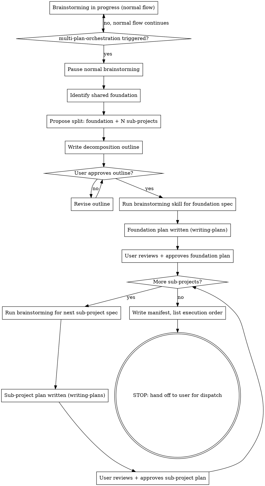

# multi-plan-orchestration Skill Design

**Date:** 2026-06-28
**Status:** Approved (all three design sections reviewed and accepted)
**Target location:** `multi-plan-orchestration/SKILL.md` in this repo

## Overview

A coordinator skill that activates during `brainstorming` when a task is too large for a single implementation plan. It decomposes the work into a foundation spec plus N independent sub-project specs, delegates each to the existing `brainstorming` and `writing-plans` skills, and produces a manifest for parallel dispatch to cheaper execution agents. The orchestrator (a strong agent) writes the specs and plans; the user dispatches the plans to cheaper agents for execution. The skill itself never dispatches execution agents.

**Core principle:** Do not reimplement brainstorming or writing-plans. The skill only adds what they lack: splitting criteria, decomposition, sequencing, a manifest, and a handoff point.

## When to trigger

The skill activates during `brainstorming` when any of these hold:

- The idea contains 2+ independent subsystems (different data, different UI surfaces, different test surfaces).
- A realistic plan would exceed roughly 15-20 bite-sized tasks (writing-plans granularity). Rough ceiling for one plan.
- Modules can be built and tested independently of each other.
- A shared foundation (data model, UI shell, shared utils, theme) is depended on by several modules. This is the foundation-first signal.
- User says it directly: "too big for one plan", "split this into modules", "parallel plans/agents".
- During brainstorming the scope keeps growing as exploration continues.

## When NOT to trigger

- Single subsystem, even if large. Use the normal flow.
- Tightly coupled modules that cannot be built or tested independently. Use one plan.
- One module plus a few extra features. Use one plan.
- User already gave separate independent tasks. Run the normal flow per task, no split needed.

## The flow



## Decomposition outline (approval gate)

Short artifact, not a full spec. Saved to `docs/artifacts/features/<topic>/YYYY-MM-DD-<topic>-outline.md`. Contains exactly:

```markdown
# <Topic> Decomposition Outline

## Foundation (shared, runs first)
- What it is: [1-2 sentences: shared data model / UI shell / utils / theme]
- Scope boundaries: [what's IN the foundation, what's NOT]
- Depended on by: [list of sub-project IDs]

## Sub-projects (run in parallel after foundation)

### SP-1: <name>
- Goal: [1 sentence]
- Why independent: [different data / UI / test surface]
- Depends on: [foundation, or "none"]
- Touches: [rough file/dir areas, no exact paths yet]

### SP-2: <name>
- ...

## Execution order
1. Foundation
2. SP-1, SP-2, ... in parallel (after foundation approved)
```

Approval gate: the user reviews this outline and approves before any spec gets written. Catches "modules aren't actually independent" or "foundation is mis-scoped" before wasting spec effort. If rejected, the orchestrator revises the split, not the specs.

## Scope-slip handling

Mid-spec, a sub-project's scope may grow beyond its outline boundary. The skill's rule:

- **Small slip** (one extra feature that fits the sub-project's theme): brainstorming handles it normally, note it in the spec.
- **Cross-boundary slip** (a sub-project starts touching another sub-project's files, or needs a new shared piece): STOP that sub-project's brainstorming. Re-open the decomposition outline. Either (a) move the slipped piece into the foundation, (b) create a new sub-project, or (c) reassign to an existing sub-project. The user approves the revised outline. Then resume.

This is the one hard rule the skill enforces, because uncontrolled scope slip is what breaks parallel execution at integration time.

## Manifest and handoff

Final artifact, saved to `docs/artifacts/features/<topic>/YYYY-MM-DD-<topic>-manifest.md`. Produced after all plans exist. Contains:

```markdown
# <Topic> Multi-Plan Manifest

## Plans
| ID | Name | Plan file | Spec file | Depends on | Status |
|----|------|-----------|-----------|------------|--------|
| F  | Foundation | docs/.../foundation-plan.md | docs/.../foundation-design.md | - | ready |
| SP-1 | <name> | docs/.../sp1-plan.md | docs/.../sp1-design.md | F | ready |
| SP-2 | <name> | docs/.../sp2-plan.md | docs/.../sp2-design.md | F | ready |

## Execution order
1. F (foundation) - one agent
2. After F approved: SP-1, SP-2 in parallel - one cheaper agent each

## Per-agent dispatch instructions
For each plan, the dispatch prompt template the user sends to a cheaper agent:
- Read plan at <path>
- Use superpowers:subagent-driven-development or executing-plans
- Report back when done

## Integration checklist (after all plans done)
- [ ] All sub-project plans report done
- [ ] Run full test suite (catches integration gaps)
- [ ] Spot-check each module against its spec
```

The manifest is the single artifact the user hands to their dispatch process. The user picks plans from the table, sends each to a cheaper agent with the per-agent dispatch prompt.

### Terminal output (STOP)

After the manifest is written and committed, the orchestrator stops. It does NOT dispatch execution agents. The skill's terminal output:

```
Manifest written to docs/artifacts/features/<topic>/YYYY-MM-DD-<topic>-manifest.md.
N+1 plans ready (1 foundation + N sub-projects).

Execution order:
1. Foundation plan first (one agent)
2. After foundation approved: SP-1, SP-2, ... in parallel (one cheaper agent each)

To dispatch: copy the per-agent dispatch prompt from the manifest for each plan
and send it to a fresh cheaper agent. Each agent uses subagent-driven-development
or executing-plans on its assigned plan.
```

No further action from the orchestrator. The user owns dispatch.

## Delegation to existing skills

The orchestrator does not re-implement brainstorming or writing-plans. For each sub-project (foundation + each SP):

1. Orchestrator invokes `superpowers:brainstorming` with the sub-project's scope (taken from the approved outline) as the input. Pass the topic-scoped location explicitly: `docs/artifacts/features/<topic>/` for the spec.
2. Brainstorming runs its normal flow: clarifying questions, design, spec self-review, the user's review gate, then invokes `superpowers:writing-plans`. Pass `docs/artifacts/plans/<topic>/` for the plan.
3. Writing-plans runs its normal flow: file structure, bite-sized tasks, self-review.
4. Orchestrator notes the resulting plan path, adds a row to the manifest, and moves to the next sub-project.

Both skills say "User preferences for spec/plan location override this default," so passing the topic-scoped location is a one-line instruction, no changes to the delegated skills.

The orchestrator's own guidance is only: triggering, decomposition, outline, sequencing, manifest, handoff. Everything else is delegated.

## File layout

### Skill location (in this repo)

```
multi-plan-orchestration/
└── SKILL.md
```

Single file. No `references/`, no `commands/`, no scripts. The skill is pure guidance that delegates to existing skills; nothing to reference or run.

### Artifacts the skill produces (in the target project)

Topic-subfolder convention (see `rubens-project-standardization/references/artifacts.md`):

```
docs/artifacts/features/<topic>/
  YYYY-MM-DD-<topic>-outline.md
  YYYY-MM-DD-<topic>-manifest.md
  YYYY-MM-DD-<foundation>-design.md
  YYYY-MM-DD-<sp-1>-design.md
  ...
docs/artifacts/features/<topic>/
  YYYY-MM-DD-<foundation>-plan.md
  YYYY-MM-DD-<sp-1>-plan.md
  ...
```

Single-plan topics still go flat in `docs/artifacts/features/` (existing flow unchanged). Multi-plan topics get a `<topic>/` subfolder. No regression.

## Testing approach (per the writing-skills Iron Law)

The skill is a discipline/process skill, so testing uses pressure scenarios with a subagent.

### RED (baseline, no skill)

- **Scenario A:** "Add a new subject to my learning website with modules X, Y, Z, W, V." Watch the agent try to cram everything into one spec/plan. Document: does it split? does it produce parallel plans? does it know when to stop?
- **Scenario B:** "This feature needs a shared data model plus 3 independent UI modules." Watch the agent miss the foundation, or put the foundation in one of the sub-plans (coupling them).
- **Scenario C:** Mid-spec, the agent discovers a 4th module. Watch it silently expand scope without re-opening the decomposition.

### GREEN (skill present)

Same scenarios. Verify: agent triggers the skill when the ceiling is hit, produces an outline + gets approval, extracts foundation, writes N+1 plans, produces manifest, stops at handoff, re-opens outline on scope slip.

### REFACTOR

Plug rationalizations found in testing (e.g., "I'll just add it to SP-2, it's related" gets an explicit counter in the scope-slip section).

The skill will NOT be written before baseline testing. Per the Iron Law and this repo's TDD convention.

## SKILL.md body section list

1. `## Overview`: one-paragraph core principle.
2. `## When to use`: splitting criteria, with a small inline trigger flowchart.
3. `## When NOT to use`: the "single plan still works" list.
4. `## The flow`: the flowchart, plus prose for each step.
5. `## Decomposition outline`: the outline format + approval gate.
6. `## Scope-slip handling`: the hard rule.
7. `## Manifest and handoff`: manifest format + terminal output. The "STOP here" emphasis.
8. `## Delegation to existing skills`: explicit "do not reimplement" note.
9. `## Common mistakes`: rationalizations table populated from RED-phase testing.

Target word count: roughly 450-550 words for the body (moderately loaded skill, not frequently loaded).

## Frontmatter (draft)

```yaml
---
name: multi-plan-orchestration
description: Use when a task is too large for a single implementation plan: multiple independent modules/subsystems, a feature that would overload one spec, or a brainstorm that has clearly outgrown one plan. Triggers: "this is too big for one plan", "split this into modules", "I want several plans for parallel agents", brainstorming scope overflow, multi-module feature requests.
---
```

Approximately 390 characters, triggering-only, no workflow summary. Compliant with AGENTS.md rules: kebab-case `name`, "Use when..." start, no em-dashes, under 1024 chars.

## Decisions locked during brainstorming

| Decision | Choice |
|----------|--------|
| Entry point | During brainstorming (orchestrator recognizes scope overflow) |
| Dependency model | Foundation-first (shared foundation runs first, then N independent sub-plans in parallel) |
| Orchestrator at execution | Plans only, user dispatches (orchestrator stops at manifest) |
| Approach | B + light C: thin coordinator + lightweight decomposition-outline approval gate |
| File layout | Topic-subfolder convention under `docs/artifacts/{specs,plans}/<topic>/` |
