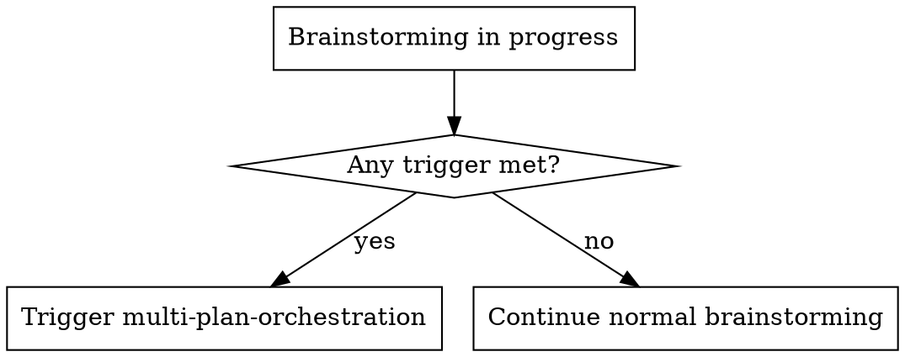
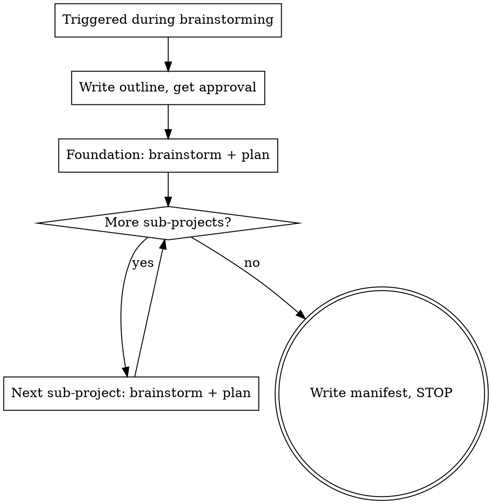

# Multi-Plan Orchestration Skill Implementation Plan

> **For agentic workers:** REQUIRED SUB-SKILL: Use superpowers:subagent-driven-development (recommended) or superpowers:executing-plans to implement this plan task-by-task. Steps use checkbox (`- [ ]`) syntax for tracking.

**Goal:** Create the `multi-plan-orchestration` skill that splits large tasks into foundation + N parallel sub-plans during brainstorming, following TDD-for-skills (RED-GREEN-REFACTOR).

**Architecture:** TDD-for-skills per the writing-skills Iron Law. RED: dispatch 3 baseline subagent scenarios without the skill, document rationalizations. GREEN: write `SKILL.md` from the approved spec + baseline findings, verify with same scenarios. REFACTOR: plug rationalizations found in GREEN. Single-file skill, no code, no references. Also updates AGENTS.md "Current skills" table and the project-standardization convention docs.

**Tech Stack:** Markdown, YAML frontmatter, graphviz dot flowcharts, subagent dispatch for skill testing.

**Spec:** `docs/artifacts/features/multi-plan-orchestration/2026-06-28-multi-plan-orchestration-design.md`

---

## File Structure

| File | Action | Responsibility |
|------|--------|----------------|
| `multi-plan-orchestration/SKILL.md` | Create | The skill itself: frontmatter + 9 body sections |
| `AGENTS.md` | Modify | Add row to "Current skills" table |

No test files (skill testing is via subagent dispatch, per writing-skills). No `references/`, no `commands/` (per spec: single-file skill).

The `docs/artifacts/features/multi-plan-orchestration/2026-06-28-multi-plan-orchestration-design.md` (spec) and `docs/artifacts/features/multi-plan-orchestration/2026-06-28-multi-plan-orchestration-plan.md` (this plan) already exist.

The project-standardization convention updates (`references/artifacts.md`, `templates/STANDARDS.md`) were already applied during brainstorming. No further changes needed unless the plan reveals gaps.

---

### Task 1: RED baseline - dispatch 3 subagent scenarios without the skill

**Files:**
- None created/modified (subagent dispatch only, findings captured in commit message)

**Purpose:** Establish baseline behavior. Per the writing-skills Iron Law, no skill is written before watching agents fail without it. The rationalizations documented here populate the "Common mistakes" table in Task 2.

- [ ] **Step 1: Dispatch subagent for Scenario A (multi-module website, no skill)**

Dispatch a subagent with this exact prompt. Do NOT mention the skill, brainstorming, writing-plans, or any decomposition methodology. This is the baseline: what does a capable agent do on its own?

```text
You are helping plan a feature. The user wants to add a physics subject to their learning website. It needs these modules:

1. Vectors explainer: interactive diagrams showing vector addition, scalar multiplication, dot/cross products
2. Forces calculator: input force vectors, get resultant force and equilibrium analysis
3. Motion animations: animate projectile motion, pendulum, spring oscillation
4. Energy visualizer: show energy transformations between kinetic, potential, thermal
5. Quiz system: multiple choice + numeric answer checking for physics problems, scored

Each module has its own UI component and data model. The website already has other subjects (math, chemistry) with similar module patterns.

Help plan this. Walk through your approach step by step. What artifacts would you produce? How would you structure the work?
```

Capture the full response. Document:
- Did the agent try to put everything in one spec/plan?
- Did it split into multiple plans? If so, how?
- Did it identify a shared foundation?
- Did it produce a manifest or dispatch instructions?
- What rationalizations did it use for its approach? (verbatim quotes)

- [ ] **Step 2: Dispatch subagent for Scenario B (shared data model + 3 UI modules, no skill)**

```text
You are helping plan a feature. The user needs:

- A shared user preferences data model: theme, language, accessibility settings, notification preferences. All modules read from this.
- 3 independent UI modules that all depend on that model:
  1. Settings panel: read/write all preferences, form-based UI
  2. Notification center: read notification prefs, display and dismiss notifications
  3. Dashboard widget system: read theme + accessibility prefs, render customizable widgets

The preferences model does not exist yet. It needs to be built first.

Help plan this. Walk through your approach step by step. What artifacts would you produce? How would you structure the work?
```

Capture the full response. Document:
- Did the agent identify the shared data model as a foundation that must run first?
- Did it put the foundation in one of the sub-plans (coupling them)?
- Did it produce parallel plans or one big plan?
- What rationalizations did it use? (verbatim quotes)

- [ ] **Step 3: Dispatch subagent for Scenario C (mid-spec scope slip, no skill)**

This scenario is two messages. Dispatch the subagent with the first prompt, wait for the response, then send the second.

First message:

```text
You are helping plan a feature. The user needs 3 modules for their e-commerce site:

1. Product catalog: browse/search products, filter by category, product detail pages
2. Shopping cart: add/remove items, calculate totals, apply discount codes
3. Checkout flow: shipping address, payment processing, order confirmation

Help plan this. Walk through your approach step by step.
```

After the subagent responds, send:

```text
Actually, the user also needs a 4th module: a product reviews system. Customers can rate products 1-5 stars, write reviews, and see aggregate scores on product pages. The reviews system needs to display review data on the product catalog pages.

How does this change your plan?
```

Capture both responses. Document:
- After the 4th module was introduced, did the agent silently expand scope?
- Did it re-open or revise its decomposition?
- Did it check whether the new module was independent or coupled?
- What rationalizations did it use? (verbatim quotes)

- [ ] **Step 4: Compile baseline findings**

From the three scenario responses, compile a rationalizations table. This is the source material for the skill's "Common mistakes" section. Format:

```markdown
| Rationalization observed | Scenario | What actually goes wrong |
|--------------------------|----------|------------------------|
| "I'll put it all in one spec, it's one feature" | A | One plan exceeds 15-20 tasks, execution agent loses context mid-plan |
| ... | ... | ... |
```

Also note:
- Which scenarios the agent split correctly (if any)
- Which scenarios the agent missed the foundation (B)
- Which scenarios the agent silently expanded scope (C)
- Any other patterns across all three

- [ ] **Step 5: Commit baseline findings**

```bash
git add docs/artifacts/features/multi-plan-orchestration/2026-06-28-multi-plan-orchestration-plan.md
git commit -m "test(multi-plan-orchestration): RED baseline - 3 scenarios without skill

Documented baseline rationalizations from 3 subagent scenarios:
- A: multi-module website (5 modules)
- B: shared data model + 3 UI modules
- C: mid-spec scope slip (4th module added)

Findings inform the Common mistakes table in SKILL.md."
```

(If the plan file was not modified during RED, commit a no-op amendment to record the findings in the message. The findings themselves are captured in the commit message and used in Task 2.)

---

### Task 2: GREEN - write SKILL.md from spec + baseline findings

**Files:**
- Create: `multi-plan-orchestration/SKILL.md`

**Purpose:** Write the skill that addresses the specific rationalizations documented in Task 1. The content is derived from the approved spec, with the "Common mistakes" table populated from Task 1's baseline findings.

- [ ] **Step 1: Create the skill directory**

```bash
mkdir multi-plan-orchestration
```

- [ ] **Step 2: Write SKILL.md**

Write the following content to `multi-plan-orchestration/SKILL.md`. The "Common mistakes" table in section 9 is populated from Task 1's baseline findings. Replace the `[FROM BASELINE]` rows with the actual rationalizations documented in Task 1, formatted as table rows. Include at minimum the rationalizations from all three scenarios.

````markdown
---
name: multi-plan-orchestration
description: Use when a task is too large for a single implementation plan: multiple independent modules/subsystems, a feature that would overload one spec, or a brainstorm that has clearly outgrown one plan. Triggers: "this is too big for one plan", "split this into modules", "I want several plans for parallel agents", brainstorming scope overflow, multi-module feature requests.
---

# Multi-Plan Orchestration

## Overview

A coordinator skill that activates during `brainstorming` when a task is too large for a single implementation plan. Decomposes the work into a foundation spec plus N independent sub-project specs, delegates each to the existing `brainstorming` and `writing-plans` skills, and produces a manifest for parallel dispatch to cheaper execution agents.

The orchestrator (a strong agent) writes specs and plans. The user dispatches the plans to cheaper agents for execution. The skill itself never dispatches execution agents.

**Core principle:** Do not reimplement brainstorming or writing-plans. Only add what they lack: splitting criteria, decomposition, sequencing, a manifest, and a handoff point.

## When to use



Trigger when any of these hold:
- The idea contains 2+ independent subsystems (different data, different UI surfaces, different test surfaces).
- A realistic plan would exceed roughly 15-20 bite-sized tasks (writing-plans granularity).
- Modules can be built and tested independently of each other.
- A shared foundation (data model, UI shell, shared utils, theme) is depended on by several modules. This is the foundation-first signal.
- User says it directly: "too big for one plan", "split this into modules", "parallel plans/agents".
- During brainstorming the scope keeps growing as exploration continues.

## When NOT to use

- Single subsystem, even if large. Use the normal flow.
- Tightly coupled modules that cannot be built or tested independently. Use one plan.
- One module plus a few extra features. Use one plan.
- User already gave separate independent tasks. Run the normal flow per task, no split needed.

## The flow



1. **Pause normal brainstorming.** The skill takes over from the brainstorming flow.
2. **Identify shared foundation.** Look for a data model, UI shell, shared utils, or theme that multiple sub-projects depend on. If none exists, all sub-projects are independent (no foundation).
3. **Propose split: foundation + N sub-projects.** Each sub-project must be independently buildable and testable after the foundation is done.
4. **Write decomposition outline.** Save to `docs/artifacts/features/<topic>/YYYY-MM-DD-<topic>-outline.md`. Get user approval before writing any specs.
5. **For the foundation:** Invoke `superpowers:brainstorming` with the foundation's scope. Pass `docs/artifacts/features/<topic>/` as the spec location. Brainstorming runs its full flow and invokes `superpowers:writing-plans` with `docs/artifacts/features/<topic>/` as the plan location. User reviews and approves the foundation plan.
6. **For each sub-project (SP-1, SP-2, ...):** Same as step 5, using the sub-project's scope from the approved outline. User reviews and approves each plan.
7. **Write manifest.** After all plans exist, produce `docs/artifacts/features/<topic>/YYYY-MM-DD-<topic>-manifest.md` with the plan table, execution order, per-agent dispatch prompts, and integration checklist.
8. **STOP.** Hand off to the user for dispatch. Do not dispatch execution agents.

## Decomposition outline

Short artifact, not a full spec. Saved to `docs/artifacts/features/<topic>/YYYY-MM-DD-<topic>-outline.md`. Contains:

```markdown
# <Topic> Decomposition Outline

## Foundation (shared, runs first)
- What it is: [1-2 sentences: shared data model / UI shell / utils / theme]
- Scope boundaries: [what's IN the foundation, what's NOT]
- Depended on by: [list of sub-project IDs]

## Sub-projects (run in parallel after foundation)

### SP-1: <name>
- Goal: [1 sentence]
- Why independent: [different data / UI / test surface]
- Depends on: [foundation, or "none"]
- Touches: [rough file/dir areas, no exact paths yet]

### SP-2: <name>
- ...

## Execution order
1. Foundation
2. SP-1, SP-2, ... in parallel (after foundation approved)
```

Approval gate: the user reviews this outline and approves before any spec gets written. If rejected, revise the split, not the specs.

## Scope-slip handling

Mid-spec, a sub-project's scope may grow beyond its outline boundary. The rule:

- **Small slip** (one extra feature that fits the sub-project's theme): brainstorming handles it normally, note it in the spec.
- **Cross-boundary slip** (a sub-project starts touching another sub-project's files, or needs a new shared piece): STOP that sub-project's brainstorming. Re-open the decomposition outline. Either (a) move the slipped piece into the foundation, (b) create a new sub-project, or (c) reassign to an existing sub-project. The user approves the revised outline. Then resume.

This is the one hard rule the skill enforces. Uncontrolled scope slip breaks parallel execution at integration time.

## Manifest and handoff

Final artifact, saved to `docs/artifacts/features/<topic>/YYYY-MM-DD-<topic>-manifest.md`. Produced after all plans exist:

```markdown
# <Topic> Multi-Plan Manifest

## Plans
| ID | Name | Plan file | Spec file | Depends on | Status |
|----|------|-----------|-----------|------------|--------|
| F  | Foundation | docs/.../foundation-plan.md | docs/.../foundation-design.md | - | ready |
| SP-1 | <name> | docs/.../sp1-plan.md | docs/.../sp1-design.md | F | ready |
| SP-2 | <name> | docs/.../sp2-plan.md | docs/.../sp2-design.md | F | ready |

## Execution order
1. F (foundation) - one agent
2. After F approved: SP-1, SP-2 in parallel - one cheaper agent each

## Per-agent dispatch instructions
For each plan, the dispatch prompt template the user sends to a cheaper agent:
- Read plan at <path>
- Use superpowers:subagent-driven-development or executing-plans
- Report back when done

## Integration checklist (after all plans done)
- [ ] All sub-project plans report done
- [ ] Run full test suite (catches integration gaps)
- [ ] Spot-check each module against its spec
```

### Terminal output (STOP)

After the manifest is written and committed, the orchestrator stops. Terminal output:

```
Manifest written to docs/artifacts/features/<topic>/YYYY-MM-DD-<topic>-manifest.md.
N+1 plans ready (1 foundation + N sub-projects).

Execution order:
1. Foundation plan first (one agent)
2. After foundation approved: SP-1, SP-2, ... in parallel (one cheaper agent each)

To dispatch: copy the per-agent dispatch prompt from the manifest for each plan
and send it to a fresh cheaper agent. Each agent uses subagent-driven-development
or executing-plans on its assigned plan.
```

No further action from the orchestrator. The user owns dispatch.

## Delegation to existing skills

The orchestrator does not re-implement brainstorming or writing-plans. For each sub-project (foundation + each SP):

1. Invoke `superpowers:brainstorming` with the sub-project's scope (from the approved outline) as input. Pass the topic-scoped location: `docs/artifacts/features/<topic>/` for the spec.
2. Brainstorming runs its normal flow and invokes `superpowers:writing-plans`. Pass `docs/artifacts/features/<topic>/` for the plan.
3. Note the resulting plan path, add a row to the manifest, move to the next sub-project.

Both skills accept user-preferred locations as an override, so passing the topic-scoped location is a one-line instruction. No changes to the delegated skills.

## Common mistakes

Populated from RED-phase baseline testing. Each row is a rationalization observed when a capable agent handles a multi-module task without this skill.

| Rationalization | What goes wrong | What this skill does instead |
|-----------------|-----------------|------------------------------|
| [FROM BASELINE: Scenario A rationalization] | [what goes wrong] | [what the skill does instead] |
| [FROM BASELINE: Scenario B rationalization] | [what goes wrong] | [what the skill does instead] |
| [FROM BASELINE: Scenario C rationalization] | [what goes wrong] | [what the skill does instead] |
| [additional rows from Task 1 findings] | ... | ... |

(Replace all `[FROM BASELINE]` rows with the actual rationalizations documented in Task 1. Each rationalization is a verbatim or near-verbatim quote from a baseline subagent response. The "What goes wrong" column names the specific failure mode. The "What this skill does instead" column points to the specific skill section that prevents it.)
````

- [ ] **Step 3: Verify no em-dashes in SKILL.md**

Run: `Select-String -Path "multi-plan-orchestration\SKILL.md" -Pattern ([char]0x2014)`
Expected: no output (clean). If any em-dashes found, replace with colons, commas, periods, or hyphens per AGENTS.md rules.

- [ ] **Step 4: Verify frontmatter compliance**

Check the YAML frontmatter against AGENTS.md rules:
- `name`: `multi-plan-orchestration` (kebab-case, matches folder name, letters/hyphens only, no special chars)
- `description`: starts with "Use when...", third person, triggering conditions only, no workflow summary
- Total frontmatter under 1024 characters

Run: measure the frontmatter character count. The description is approximately 390 characters. Total frontmatter including `name`, `description`, and YAML delimiters should be well under 1024.

- [ ] **Step 5: Verify body structure**

Check:
- First heading is `## Overview` (not `# Skill` or `## Skill`)
- No `## Skill` heading anywhere
- Sections in order: Overview, When to use, When NOT to use, The flow, Decomposition outline, Scope-slip handling, Manifest and handoff, Delegation to existing skills, Common mistakes
- No em-dashes (already checked in Step 3, re-verify if any edits were made)

- [ ] **Step 6: Commit**

```bash
git add multi-plan-orchestration/SKILL.md
git commit -m "feat(multi-plan-orchestration): GREEN - write skill from spec + baseline findings

SKILL.md with 9 sections per approved spec:
- frontmatter: name + triggering-only description
- trigger flowchart + splitting criteria
- main flow flowchart + 8-step prose
- decomposition outline template + approval gate
- scope-slip hard rule (cross-boundary = re-open outline)
- manifest template + terminal STOP output
- delegation pattern to brainstorming + writing-plans
- Common mistakes table populated from RED baseline

Single-file skill, no references/ or commands/."
```

---

### Task 3: GREEN verify - dispatch 3 subagent scenarios with the skill

**Files:**
- None created/modified (subagent dispatch only, verification captured in commit message)

**Purpose:** Verify the skill produces the expected behavior. Same 3 scenarios as Task 1, but with the skill content prepended to the subagent prompt. The agent should now trigger the skill, produce an outline, extract the foundation, write N+1 plans, produce a manifest, and stop at handoff.

- [ ] **Step 1: Dispatch subagent for Scenario A WITH skill content**

Read `multi-plan-orchestration/SKILL.md` (the file written in Task 2). Dispatch a subagent with the SKILL.md content as context, followed by the same scenario prompt from Task 1, Step 1:

```text
<SKILL.md content here>

---

You are helping plan a feature. The user wants to add a physics subject to their learning website. It needs these modules:

1. Vectors explainer: interactive diagrams showing vector addition, scalar multiplication, dot/cross products
2. Forces calculator: input force vectors, get resultant force and equilibrium analysis
3. Motion animations: animate projectile motion, pendulum, spring oscillation
4. Energy visualizer: show energy transformations between kinetic, potential, thermal
5. Quiz system: multiple choice + numeric answer checking for physics problems, scored

Each module has its own UI component and data model. The website already has other subjects (math, chemistry) with similar module patterns.

Help plan this. Walk through your approach step by step. What artifacts would you produce? How would you structure the work?
```

(The `<SKILL.md content here>` is the full text of the file written in Task 2, Step 2. Paste it verbatim as the first part of the subagent prompt, then a `---` separator, then the scenario prompt.)

Verify the response:
- Does the agent trigger multi-plan-orchestration? (recognizes 5 independent modules)
- Does it propose a decomposition outline with foundation + sub-projects?
- Does it get approval before writing specs?
- Does it produce a manifest at the end?
- Does it STOP at handoff (not dispatch execution agents)?
- Does it delegate to brainstorming/writing-plans (not reimplement them)?

- [ ] **Step 2: Dispatch subagent for Scenario B WITH skill content**

Same pattern: SKILL.md content + scenario prompt from Task 1, Step 2:

```text
<SKILL.md content here>

---

You are helping plan a feature. The user needs:

- A shared user preferences data model: theme, language, accessibility settings, notification preferences. All modules read from this.
- 3 independent UI modules that all depend on that model:
  1. Settings panel: read/write all preferences, form-based UI
  2. Notification center: read notification prefs, display and dismiss notifications
  3. Dashboard widget system: read theme + accessibility prefs, render customizable widgets

The preferences model does not exist yet. It needs to be built first.

Help plan this. Walk through your approach step by step. What artifacts would you produce? How would you structure the work?
```

Verify:
- Does the agent identify the shared preferences model as the foundation?
- Does it sequence foundation first, then 3 UI modules in parallel?
- Does it NOT put the foundation inside one of the sub-plans?

- [ ] **Step 3: Dispatch subagent for Scenario C WITH skill content (two messages)**

First message: SKILL.md content + first scenario prompt from Task 1, Step 3:

```text
<SKILL.md content here>

---

You are helping plan a feature. The user needs 3 modules for their e-commerce site:

1. Product catalog: browse/search products, filter by category, product detail pages
2. Shopping cart: add/remove items, calculate totals, apply discount codes
3. Checkout flow: shipping address, payment processing, order confirmation

Help plan this. Walk through your approach step by step.
```

After the subagent responds, send the second message:

```text
Actually, the user also needs a 4th module: a product reviews system. Customers can rate products 1-5 stars, write reviews, and see aggregate scores on product pages. The reviews system needs to display review data on the product catalog pages.

How does this change your plan?
```

Verify:
- After the 4th module is introduced, does the agent recognize this as a cross-boundary slip (reviews touch the catalog pages)?
- Does it STOP and re-open the decomposition outline?
- Does it propose moving the reviews-catalog integration into the foundation, or creating a new sub-project, or reassigning?
- Does it get user approval for the revised outline before continuing?

- [ ] **Step 4: Document verification results**

For each scenario, record:
- Did the agent comply with the skill? (pass/fail per verification criterion)
- Any new rationalizations or loopholes not caught by the skill?
- Any sections of the skill that were unclear or ignored?

If all 3 scenarios pass: proceed to Step 5.
If any scenario fails: note the specific failure for Task 4 (REFACTOR).

- [ ] **Step 5: Commit verification results**

```bash
git commit --allow-empty -m "test(multi-plan-orchestration): GREEN verify - 3 scenarios with skill

Scenario A (multi-module website): [PASS/FAIL] - [brief note]
Scenario B (shared data model): [PASS/FAIL] - [brief note]
Scenario C (scope slip): [PASS/FAIL] - [brief note]

[If any FAIL: note specific rationalizations for REFACTOR task]"
```

---

### Task 4: REFACTOR - plug rationalizations from GREEN verify

**Files:**
- Modify: `multi-plan-orchestration/SKILL.md` (only if Task 3 found new rationalizations or loopholes)

**Purpose:** Close any loopholes discovered during GREEN verification. If Task 3 passed all 3 scenarios cleanly, this task is a no-op (mark complete, commit nothing). If any scenario failed, add explicit counters to the "Common mistakes" table or the relevant skill section.

- [ ] **Step 1: Review Task 3 findings**

Read the verification results from Task 3, Step 4. For each scenario that failed:
- What rationalization did the agent use to bypass the skill?
- Which skill section should have prevented it?
- Was the section unclear, missing, or ignored?

- [ ] **Step 2: Add counters to SKILL.md (only if failures found)**

For each failure, add either:
- A new row to the "Common mistakes" table with the rationalization, what goes wrong, and what the skill does instead
- Or an explicit counter in the relevant section (e.g., if the agent ignored the scope-slip rule, add a "Red Flags" list to the Scope-slip handling section)

Read `multi-plan-orchestration/SKILL.md` before editing. Make targeted edits only.

If no failures: skip to Step 4.

- [ ] **Step 3: Re-verify affected scenarios (only if SKILL.md was modified)**

Re-dispatch the subagent(s) for the scenario(s) that failed, using the same prompt structure as Task 3 (SKILL.md content + scenario prompt). Verify the loophole is now closed.

If the loophole persists, repeat Steps 2-3 until the agent complies.

- [ ] **Step 4: Commit (only if SKILL.md was modified)**

```bash
git add multi-plan-orchestration/SKILL.md
git commit -m "refactor(multi-plan-orchestration): close loopholes from GREEN verify

[If no changes needed:]
No loopholes found. All 3 scenarios passed GREEN verify cleanly.

[If changes made:]
Added [N] rationalization counters to Common mistakes table:
- [rationalization 1]: [what section counters it]
- [rationalization 2]: [what section counters it]"
```

If no changes were made (all scenarios passed), commit with `--allow-empty`:
```bash
git commit --allow-empty -m "refactor(multi-plan-orchestration): no loopholes found in GREEN verify

All 3 scenarios passed. Common mistakes table sufficient."
```

---

### Task 5: Admin - update AGENTS.md + final verification

**Files:**
- Modify: `AGENTS.md` (add row to "Current skills" table, around line 70)

**Purpose:** Register the new skill in the repo's catalog and run final compliance checks per AGENTS.md rules.

- [ ] **Step 1: Read AGENTS.md to find the "Current skills" table**

Read `AGENTS.md` and locate the "Current skills" table. It has this structure:

```markdown
| Folder | `name` in frontmatter | What it does |
|---|---|---|
| `drawio-pro/` | `drawio-pro` | ... |
...
```

- [ ] **Step 2: Add the new skill row to the table**

Add this row after the last existing row (before any closing content):

```markdown
| `multi-plan-orchestration/` | `multi-plan-orchestration` | Splits large tasks into foundation + N parallel sub-plans during brainstorming. Decomposition outline, scope-slip handling, manifest with per-agent dispatch prompts. Delegates to existing brainstorming + writing-plans skills. |
```

- [ ] **Step 3: Verify no em-dashes in any new or modified file**

Run:
```powershell
Select-String -Path "multi-plan-orchestration\SKILL.md" -Pattern ([char]0x2014)
Select-String -Path "AGENTS.md" -Pattern ([char]0x2014)
```
Expected: no output for either. The AGENTS.md check should only flag pre-existing em-dashes (if any); verify none were introduced by the new table row.

- [ ] **Step 4: Verify frontmatter one final time**

Read `multi-plan-orchestration/SKILL.md` and confirm:
- `name` is `multi-plan-orchestration`, matches the folder name
- `description` starts with "Use when..."
- `description` does not summarize the workflow (only triggering conditions)
- `description` is third person
- Total frontmatter is under 1024 characters
- No em-dashes in frontmatter

- [ ] **Step 5: Verify body rules one final time**

Confirm:
- Body starts with `## Overview`
- No `## Skill` heading
- Sections in the order specified in the spec
- No em-dashes anywhere in the body
- Word count is reasonable for a non-frequently-loaded skill (target ~450-700 words; the templates push it above 500 but they are essential reference content)

- [ ] **Step 6: Commit**

```bash
git add AGENTS.md
git commit -m "docs(skills): register multi-plan-orchestration in Current skills table

Adds row for the new coordinator skill that splits large tasks
into foundation + N parallel sub-plans during brainstorming."
```

---

## Self-Review

### Spec coverage

| Spec section | Covered by task |
|--------------|-----------------|
| Frontmatter (name, description) | Task 2, Step 2 + Step 4 |
| Overview | Task 2, Step 2 |
| When to use (triggering criteria) | Task 2, Step 2 |
| When NOT to use | Task 2, Step 2 |
| The flow (flowchart + prose) | Task 2, Step 2 |
| Decomposition outline (format + gate) | Task 2, Step 2 |
| Scope-slip handling (hard rule) | Task 2, Step 2 |
| Manifest and handoff (format + STOP) | Task 2, Step 2 |
| Delegation to existing skills | Task 2, Step 2 |
| Common mistakes (from RED baseline) | Task 1 (RED) + Task 2, Step 2 |
| Testing approach (RED-GREEN-REFACTOR) | Tasks 1-4 |
| File layout (single file in repo) | Task 2, Step 1 |
| AGENTS.md "Current skills" row | Task 5, Step 2 |
| Em-dash verification | Task 2, Step 3 + Task 5, Step 3 |
| Frontmatter verification | Task 2, Step 4 + Task 5, Step 4 |
| Body verification | Task 2, Step 5 + Task 5, Step 5 |

No spec gaps identified.

### Placeholder scan

The `[FROM BASELINE]` markers in Task 2, Step 2 are intentional: they mark where the executor must insert findings from Task 1. This is the TDD-for-skills dependency: the Common mistakes table content comes from observed baseline behavior, not from the spec. The markers are not placeholders in the "No Placeholders" sense (which forbids vague hand-waves like "TBD" or "add appropriate error handling"). They are specific insertion points with clear formatting instructions and a defined source (Task 1's output).

### Type consistency

The skill name `multi-plan-orchestration` is consistent across:
- Folder name: `multi-plan-orchestration/`
- Frontmatter `name`: `multi-plan-orchestration`
- AGENTS.md table row: `multi-plan-orchestration/` and `multi-plan-orchestration`
- Commit messages: `feat(multi-plan-orchestration):`, `test(multi-plan-orchestration):`, etc.

The artifact paths are consistent between the spec, the SKILL.md content, and the project-standardization convention updates:
- Specs: `docs/artifacts/features/<topic>/`
- Plans: `docs/artifacts/features/<topic>/`
- Outline: `docs/artifacts/features/<topic>/YYYY-MM-DD-<topic>-outline.md`
- Manifest: `docs/artifacts/features/<topic>/YYYY-MM-DD-<topic>-manifest.md`
