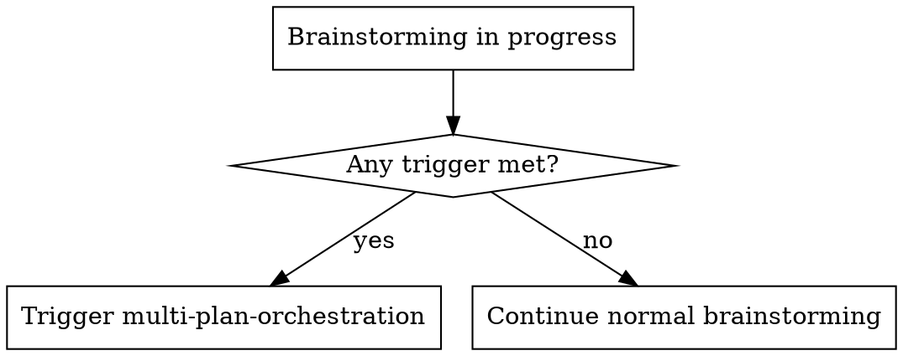
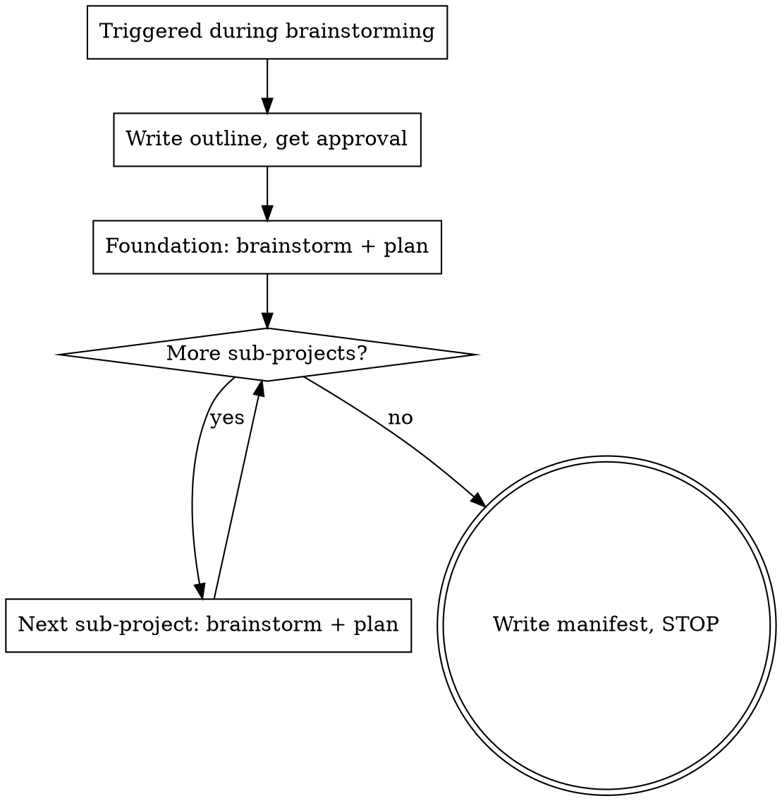

# Multi-Plan Orchestration

## Overview

A coordinator skill that activates during `brainstorming` when a task is too large for a single implementation plan. Decomposes the work into a foundation spec plus N independent sub-project specs, delegates each to the existing `brainstorming` and `writing-plans` skills, and produces a manifest for parallel dispatch to cheaper execution agents.

The orchestrator (a strong agent) writes specs and plans. The user dispatches the plans to cheaper agents for execution. The skill itself never dispatches execution agents.

**Core principle:** Do not reimplement brainstorming or writing-plans. Only add what they lack: splitting criteria, decomposition, sequencing, a manifest, and a handoff point.

## When to use



Trigger when any of these hold:

- The idea contains 2+ independent subsystems (different data, different UI surfaces, different test surfaces).
- A realistic plan would exceed roughly 15-20 bite-sized tasks (writing-plans granularity).
- Modules can be built and tested independently of each other.
- A shared foundation (data model, UI shell, shared utils, theme) is depended on by several modules. Foundation-first signal.
- User says it directly: "too big for one plan", "split this into modules", "parallel plans/agents".
- During brainstorming the scope keeps growing as exploration continues.

## When NOT to use

- Single subsystem, even if large. Use the normal flow.
- Tightly coupled modules that cannot be built or tested independently. Use one plan.
- One module plus a few extra features. Use one plan.
- User already decomposed the work into independent tasks. Run the normal flow per task, no further split needed.

## The flow



1. **Pause normal brainstorming.** The skill takes over from the brainstorming flow.
2. **Identify shared foundation.** Look for a data model, UI shell, shared utils, or theme that multiple sub-projects depend on. If none exists, all sub-projects are independent.
3. **Propose split: foundation + N sub-projects.** Each sub-project must be independently buildable and testable after the foundation is done.
4. **Write decomposition outline.** Save to `docs/artifacts/multi-plans/<topic>/YYYY-MM-DD-<topic>-outline.md`. Get user approval before writing any specs.
5. **For the foundation:** Invoke `superpowers:brainstorming` with the foundation's scope. Pass `docs/artifacts/specs/<topic>/` as the spec location. Brainstorming runs its full flow and invokes `superpowers:writing-plans` with `docs/artifacts/plans/<topic>/` as the plan location. User reviews and approves the foundation plan.
6. **For each sub-project (SP-1, SP-2, ...):** Same as step 5, using the sub-project's scope from the approved outline. User reviews and approves each plan.
7. **Write manifest.** After all plans exist, produce `docs/artifacts/multi-plans/<topic>/YYYY-MM-DD-<topic>-manifest.md` with the plan table, execution order, per-agent dispatch prompts, and integration checklist.
8. **STOP.** Hand off to the user for dispatch. Do not dispatch execution agents.

## Decomposition outline

Short artifact, not a full spec. Saved to `docs/artifacts/multi-plans/<topic>/YYYY-MM-DD-<topic>-outline.md`.

```markdown
# <Topic> Decomposition Outline

## Foundation (shared, runs first)
- What it is: [1-2 sentences: shared data model / UI shell / utils / theme]
- Scope boundaries: [what's IN, what's NOT]
- Depended on by: [list of sub-project IDs]

## Sub-projects (run in parallel after foundation)

### SP-1: <name>
- Goal: [1 sentence]
- Why independent: [different data / UI / test surface]
- Depends on: [foundation, or "none"]
- Touches: [rough file/dir areas]

### SP-2: <name>
- ...

## Execution order
1. Foundation
2. SP-1, SP-2, ... in parallel
```

Approval gate: the user reviews this outline and approves before any spec gets written. If rejected, revise the split, not the specs.

## Scope-slip handling

Mid-spec, a sub-project's scope may grow beyond its outline boundary.

- **Small slip** (one extra feature that fits the sub-project's theme): brainstorming handles it normally, note it in the spec.
- **Cross-boundary slip** (a sub-project starts touching another sub-project's files, or needs a new shared piece, or foundation-creep appears): STOP that sub-project's brainstorming. Re-open the decomposition outline. Either (a) move the slipped piece into the foundation, (b) create a new sub-project, or (c) reassign to an existing sub-project. The user approves the revised outline. Then resume.

This is the one hard rule the skill enforces. Uncontrolled scope slip breaks parallel execution at integration time.

## Manifest and handoff

Final artifact, saved to `docs/artifacts/multi-plans/<topic>/YYYY-MM-DD-<topic>-manifest.md`.

### Branch naming

Git's checkout ambiguity trips agents when one branch is a prefix of another. Avoid by using a short `topic-slug`:

- Foundation: `feat/<topic-slug>` (integration branch).
- Sub-projects: `feat/<topic-slug>/sp-N-<name>`.

`<topic-slug>` = short kebab-case (≤6 chars is safe), no `/`, not a prefix of any other existing branch.

```markdown
# <Topic> Multi-Plan Manifest

## Plans
| ID | Name | Branch | Plan file | Spec file | Depends on | Status |
|----|------|--------|-----------|-----------|------------|--------|
| F  | Foundation | `feat/<topic-slug>` | docs/.../foundation-plan.md | docs/.../foundation-design.md | - | ready |
| SP-1 | <name> | `feat/<topic-slug>/sp-1-<name>` | docs/.../sp1-plan.md | docs/.../sp1-design.md | F merged | ready |
| SP-2 | <name> | `feat/<topic-slug>/sp-2-<name>` | docs/.../sp2-plan.md | docs/.../sp2-design.md | F merged | ready |

## Execution order
1. F on `feat/<topic-slug>` - one agent. Commits land directly on the feature branch; user merges to base via PR when ready.
2. After F merged: SP-1 on `feat/<topic-slug>/sp-1-<name>`, SP-2 on `feat/<topic-slug>/sp-2-<name>` in parallel - one cheaper agent each. Each SP branches off the merged `feat/<topic-slug>`.
3. After all SPs merged: integration verification on `feat/<topic-slug>`.

## Per-agent dispatch instructions
For each row in the table, the dispatch prompt template the user sends to a cheaper agent:
- Read plan at <plan file path>
- Branch: <branch from row>; create from `feat/<topic-slug>` (SPs) or work directly on the feature branch (foundation)
- Use superpowers:subagent-driven-development or executing-plans on the assigned plan
- Open a PR back to `feat/<topic-slug>` (SPs) or to the base branch (foundation)
- Report back with the PR URL and a one-line status when the PR is ready for review

## Integration checklist (after all plans done)
- [ ] All sub-project PRs merged into `feat/<topic-slug>`
- [ ] Run full test suite on `feat/<topic-slug>` (catches integration gaps)
- [ ] Spot-check each module against its spec
```

### Terminal output (STOP)

After the manifest is written and committed, the orchestrator stops:

```
Manifest written to docs/artifacts/multi-plans/<topic>/YYYY-MM-DD-<topic>-manifest.md.
N+1 plans ready (1 foundation + N sub-projects).

Execution order:
1. Foundation plan first (one agent), commits on `feat/<topic-slug>`
2. After foundation merged to base: SP-1, SP-2, ... in parallel (one cheaper agent each), each on its own sub-branch

To dispatch: copy the per-agent dispatch prompt from the manifest for each plan
and send it to a fresh cheaper agent. Each agent uses subagent-driven-development
or executing-plans on its assigned plan and opens a PR back to `feat/<topic-slug>`
(SPs) or to the base branch (foundation).
```

No further action from the orchestrator. The user owns dispatch.

## Delegation to existing skills

The orchestrator does not re-implement brainstorming or writing-plans. For each sub-project (foundation + each SP):

1. Invoke `superpowers:brainstorming` with the sub-project's scope (from the approved outline) as input. Pass the topic-scoped location: `docs/artifacts/specs/<topic>/` for the spec.
2. Brainstorming runs its normal flow and invokes `superpowers:writing-plans`. Pass `docs/artifacts/plans/<topic>/` for the plan.
3. Note the resulting plan path, add a row to the manifest, move to the next sub-project.

Both skills accept user-preferred locations as an override, so passing the topic-scoped location is a one-line instruction. No changes to the delegated skills.

## Common mistakes

Populated from RED-phase baseline testing. Each row is a rationalization observed when a capable agent handles a multi-module task without this skill.

| Rationalization | What goes wrong | What this skill does instead |
|-----------------|-----------------|------------------------------|
| A: "Scope flag: 5 modules ... is a decomposition candidate, not a single spec. I'd split it." | Correct instinct, no structure. Never writes the split down as an artifact, jumps straight to "Phase 0: brainstorm + spec, one design doc". | Decomposition outline forces the split to be a saved, approvable artifact, not an in-passing observation. |
| A: "physics-subject-design.md - spec (one doc)" | Proposes ONE spec despite identifying the split. The decomposition never becomes a real artifact, so all modules end up collapsed into one design doc. | Decomposition outline is the spec's parent. One outline = N specs, never one spec. |
| A: "One question to ground it: the learning website isn't in this directory" | Never reaches STOP / handoff. Treats the decomposition outline as a clarifying-question gate instead of as the handoff. | Manifest and handoff: outline IS the handoff. Terminal output is a STOP block, not more questions. |
| B: "Spec the preferences model first. It is the contract every other module reads" | Correct foundation-first instinct, but framed as an ordering decision, not as a separate plan + manifest artifact. The foundation becomes a phase in one spec. | The flow, step 2 + step 5: foundation is a distinct sub-project with its own brainstorm, plan, and manifest row. |
| B: "Brainstorming them in parallel would produce three different mental models of the shape" | Recognizes the parallel-coordination problem, never formalizes the fix. No outline, no manifest, the insight evaporates. | Decomposition outline locks the shape in writing. Manifest pins it for parallel dispatch. |
| B: "A short dependency diagram in the model spec ... useful when you later ask can I add a fourth module?" | Sees the value of a manifest retroactively, as an afterthought inside another spec. The manifest is never the deliverable. | Manifest and handoff: the manifest IS the deliverable. No plan is "done" until its row is in the manifest. |
| C: "Still one cohesive spec. Reviews couples to catalog ... but stays cohesive with the purchase flow. No decomposition needed." | Classic cross-boundary slip. Acknowledges coupling to catalog, then rejects decomposition anyway. The new module is silently absorbed into the existing spec. | Scope-slip handling: cross-boundary = STOP and re-open the outline. Coupling to another sub-project is exactly the trigger. |
| C: "Data model impact: Catalog needs denormalized aggregate fields (avg_rating, review_count) from day one" | Sees foundation-creep but treats it as a coding concern. The new aggregate fields belong in the foundation or a new SP, not in the catalog's spec. | Scope-slip handling: foundation-creep = re-open outline, move the new fields to the foundation or a new SP. |
| C: "New clarifying questions to add (so ~6-8 total now)" | Expands scope by adding more questions to the same spec, instead of flagging the new module for separate handling. The original spec balloons. | When to use + Scope-slip handling: a new module mid-spec is a trigger. STOP brainstorming on the current SP, re-open the outline. |

## Commands

Slash command associated with this skill. Source lives in the top-level `commands/multi-plan.md` and is inactive until copied to the agent's commands directory.

| Command | Purpose |
|---------|---------|
| `/multi-plan` | Start the orchestration flow. Loads the skill, checks the trigger criteria, identifies the foundation, writes the decomposition outline, stops for approval. |

### Sync pattern

Agents do not auto-discover commands from the skills directory. Two-step sync:

1. Copy the `multi-plan-orchestration/` folder to the agent's skills directory (e.g. `~/.claude/skills/`).
2. Copy `commands/multi-plan.md` to the agent's commands directory:

| Agent | Global | Per-project |
|-------|--------|-------------|
| OpenCode | `~/.config/opencode/command/` | `.opencode/command/` |
| Claude Code | `~/.claude/commands/` | `.claude/commands/` |

The command file is dead weight inside the skills directory until step 2.
