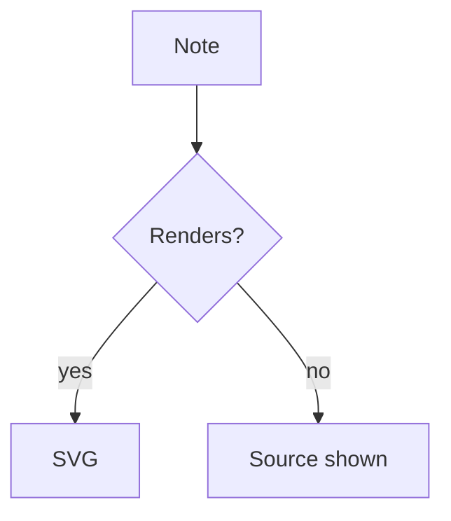
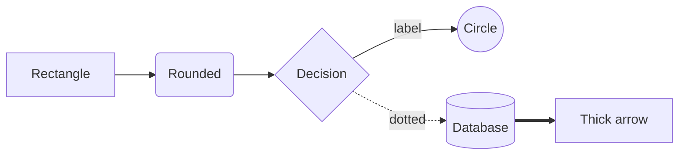
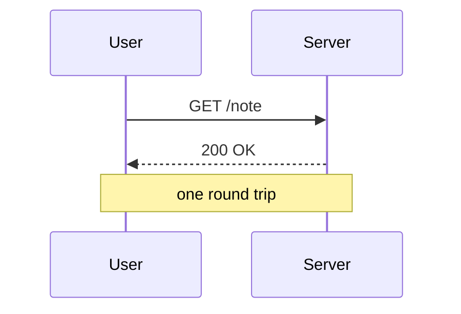
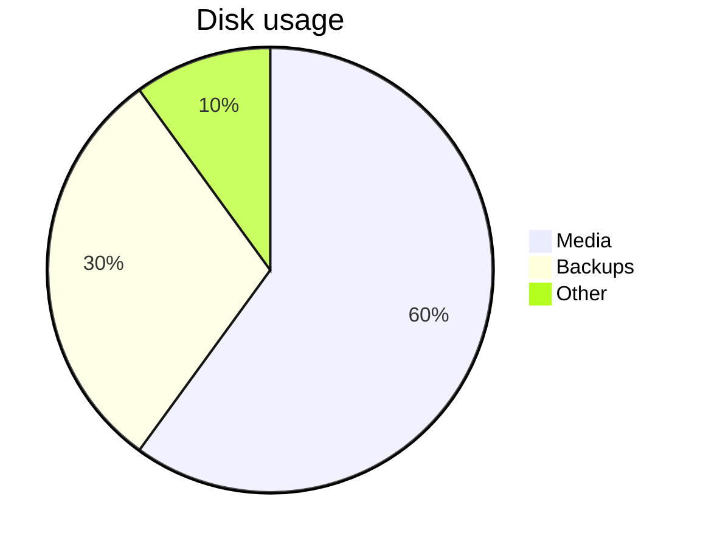

# Cheatsheet: mermaid fence

A ` ```mermaid ` fence renders a diagram via mermaid.js. Keep the fence name
lowercase - the render surface tolerates other casing, but the live editor
round-trip is case-sensitive.

````markdown

````

## Theme

Follows the console theme automatically (light or dark) and re-renders when
it flips. Do not add `%%{init: ...}%%` theme directives; let the console
pick the theme.

## Flowchart quick reference

````markdown

````

- Directions: `TD` (top down), `LR`, `RL`, `BT`.
- Node shapes: `id[text]` rectangle, `id(text)` rounded, `id{text}` diamond,
  `id((text))` circle, `id[(text)]` cylinder, `id[/text/]` parallelogram.
- Edges: `-->` solid, `---` line without arrow, `-.->` dotted, `==>` thick.
  Put a label with `-->|label|` or `-- label -->`.
- Group with `subgraph Name ... end`; nested nodes inherit the flow.

## Other diagram types

One compact example each; mermaid syntax otherwise applies unchanged.

````markdown

````

````markdown

````

Also available: `stateDiagram-v2`, `classDiagram`, `erDiagram`, `gantt`,
`mindmap`, `journey`. Same fence, mermaid syntax as body.

## Failure modes

- A mermaid syntax error renders the sanitized source as plain text inside
  the note; nothing else breaks. Fix the source to render.
- PDF export does **not** draw mermaid: the PDF shows the source in a box
  with a "not rendered in PDF" marker. Keep diagrams that must survive
  PDF export as text, a table, or a `plot` fence instead.
